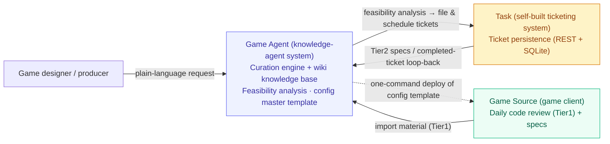

**English** · [繁體中文](README.zh-Hant.md) · [简体中文](README.zh-Hans.md)

# GamePlusAIAgent — An AI Agent System for Cross-Team Game-Dev Collaboration

> Through the collaboration of three systems, this project automatically curates each day's development output into a living knowledge base that **AI and humans read together**, while letting requirements flow smoothly into tickets.

*"The morning I realized I was spending time re-explaining the entire codebase to my AI assistant every single day, I decided to build it a knowledge hub that could curate itself."*

This project is a **design showcase (de-identified)** of an AI agent system built for a real, commercial Unity mobile-game project.
At its core it is not merely a knowledge base, but a solution to **cross-team collaboration in game development** — formed by three collaborating systems: **Game Source (the game client)**, **Game Agent (the knowledge-agent system)**, and **Task (a self-built ticketing system)**.

> What this repo aims to show is not simply that "the code runs," but a series of **counter-intuitive system-design trade-offs** — each decision distilled from real-world pitfalls.
> If you are short on time, jump straight to [Design Highlights](#design-highlights-system-layer).

---

## Core Pain Points & Solution

Over the long-term development of a large game project, for AI to genuinely land and assist development it must answer three questions:

- **How to use AI to optimize the game-dev process**: development facts are scattered across commits, code reviews, and ticket specs. Every time AI is brought in, it must re-understand the whole project — slow, with unstable output.
- **How to use AI to help file requirements into tickets**: game designers struggle to clear the technical bar of the code, yet when raising a requirement they must know "what this feature touches, and whether the implementation is feasible."
- **How to iterate the project wiki so the next project ramps into AI+Game development fast**: every new project rebuilds its knowledge and toolchain from scratch — extremely costly, and past accumulation is hard to retain or reuse.

The system answers these through the collaboration of three systems:
**Game Source continuously produces development data → Game Agent automatically curates it into a wiki knowledge base and performs requirement-feasibility analysis → the analysis results flow into the Task ticketing system for scheduling → once a ticket is completed it loops back into the Agent for distillation, forming a continuously growing knowledge flywheel.**

---

## The Three Systems & Responsibility Boundaries

The heart of the whole solution lies in three systems that are **independently maintained, with clearly separated responsibilities**, and in the boundaries deliberately designed between them:

| System | Role | Core Responsibility | Boundary & Decoupling |
|--------|------|---------------------|------------------------|
| **Game Source** (game client) | Data source | Produces daily code reviews (high-authority facts), specs, and other development output; receives the deployed agent configuration | A read-only deployment target — it only feeds material; it takes no part in curation |
| **Game Agent** (knowledge-agent system) | The system's brain | Curates data into a wiki knowledge base and performs requirement-feasibility analysis; maintains the agent config master template and deploys it with one command | Lives outside the game client; **portable** to the next project |
| **Task** (self-built ticketing system) | Collaboration hub | Receives AI-refined requirements and tracks them persistently; loops completed tickets back to the Agent | **Fully decoupled** from the other two, **interacting only via REST**; contains no LLM itself |

---

## How the System Works (Data Lifecycle)

Setting aside the tedious install commands, the best way to understand this system is to follow **the full journey of one piece of knowledge — from creation, to consumption, to loop-back**:

1. **Produce** — Game Source commits daily, and an upstream skill automatically generates two artifacts: an "engineering retrospective report (for humans to read)" kept on the local side, and **"code-fact material"** carrying no subjective judgment (formatted as: `what was done + file path:line number`).
2. **Ingest** — The code-fact material and the ticket specs are placed together into the knowledge base's `raw/` inbox.
3. **Curate** — Running the `/curate` command, the cleaning engine breaks the raw data down into structured topic knowledge pages while maintaining three core states: **incremental de-duplication**, **authority arbitration**, and a **conflict queue**.
4. **Index** — Via `build_index.py`, the frontmatter of each topic page is extracted to **automatically regenerate** a semantic routing table, the `INDEX` (hand-editing is strictly forbidden).
5. **Recall & QA** — When a game designer raises a new requirement in plain language, the system uses `/stopic` or `/ask` to precisely recall the relevant topic knowledge pages through the `INDEX`.
6. **Execute** — Based on the recalled knowledge, AI judges "which `.cs` files will be affected and how feasible the underlying implementation is," produces a development plan, and files the requirement as a ticket that flows into Task for scheduling.
7. **Feedback** — Once a Task ticket is completed, it is exported back to the Agent and re-enters `/curate` for distillation, so the knowledge base keeps growing as the project evolves.

---

## Design Highlights (System Layer)

Below are the three core decisions at the **system layer**; the deeper **knowledge-engine engineering details** are pointed to at the end.

### A. A self-built ticketing system, instead of adopting Jira / Trello / Mantis

- **Problem**: ticket requirements for game content are highly customized and need deep integration with the AI agent workflow — general-purpose industry tools struggle to fit.
- **Trade-off**: rather than adopting general-purpose ticketing tools such as Jira / Trello / Mantis, we built a **self-built ticketing system** (adapted from an existing in-house system, with its core extracted and reworked).
- **Design principle**: kept deliberately minimal and **fully decoupled** from the Agent / Source (interacting only via REST), the ticketing system itself **contains no LLM** — all AI intelligence is concentrated on the Agent side, while the ticketing system purely handles persistence and tracking of requirements.
- **Effect**: tickets can be customized to follow game-content needs, and thanks to the decoupling they are easy to maintain and never hold back the Agent's evolution.

### B. Game Agent is decoupled from Game Source and portable to the next project

- **Problem**: building a fresh AI knowledge system and toolchain from scratch for every new game project is extremely costly.
- **Trade-off**: the Agent system is kept **outside the game client**; the agent configuration (instructions, commands, conventions) is maintained centrally in a "**config master template**," then **deployed with one command** to the game side by an installer.
- **Effect**: when moving to the next project, copying the Agent, adjusting the config master template, and configuring the paths is enough to roll the whole mechanism out quickly — accumulation is not lost when a project ends.

### C. A three-system data flywheel: a knowledge base that gets stronger with use

- Game Source continuously produces development output such as code reviews and specs;
- Task tickets are exported back to the Agent both at the **spec stage** (Tier2 material) and at the **completion stage** (loop-back for distillation);
- the Agent curates and accumulates all of the above into a continuously growing wiki knowledge base that feeds back into requirement analysis.
- **Effect**: the longer the project runs, the stronger the knowledge base — and the faster the next AI+Game project can get up to speed.

> 🔧 **Want to dig into the engineering details of the "knowledge engine" that powers this system?**
> Covering why not RAG (moving structuring to write-time), the "the LLM never infers" hard rule, the single-file three-tier format, authority arbitration, INDEX drift-protection, incremental de-duplication, and other counter-intuitive trade-offs —
> see the full write-up in [`docs/design-notes.md`](docs/design-notes.md).

---

## Architecture

For the complete system architecture (the three systems' responsibility boundaries, the data-flow pipeline, directory structure, cross-tool loading chain, authority-arbitration state machine, and INDEX maintenance chain), see [`docs/architecture.md`](docs/architecture.md).

---

## Tech Stack & Core Commands

- **Curation / indexing engine**: Python (mostly standard library, to reduce deployment dependencies)
- **Knowledge-page format**: Markdown (single-file three-tier architecture)
- **Cross-tool loading chain**: `CLAUDE.md` → `@AGENTS.md` → `@.agent/spec/*`; the command layer is wired with junctions
- **Ticketing integration**: a self-built ticketing system, interacting via REST API
- **Config-driven**: all paths, sources, and authority tiers are centralized in `config.json`, which the engine always reads, **eliminating hard-coding** (also the key to cross-project portability)

| Command | Purpose | Read / Write |
|---------|---------|--------------|
| `/curate` | Clean and import raw into the wiki, maintain .state and regenerate INDEX | reads raw, writes wiki / .state |
| `/stopic` | Load relevant topic pages by keyword / semantics (multi-page recall) | read-only wiki |
| `/ask` | Knowledge-base QA | read-only wiki |
| `/resolve` | Handle pending items in the `review_queue` | reads / writes .state |

---

## Project Status

This is a system **running on a real project**, not a proof-of-concept draft.

**Shipped**

- The three-system collaboration skeleton (Game Source feeding material, Game Agent curating, Task persisting tickets) is running.
- The curation engine and the four commands (`/curate`, `/stopic`, `/ask`, `/resolve`) all work as intended.
- The cross-tool loading chain (`@import` + junction) and the config-driven design (`config.json` removing hard-coding) are fully built.
- The INDEX auto-regenerates from frontmatter, with a CI `--check` drift-protection mechanism.
- The agent config master template can be deployed to the game client with one command; dozens of days of code reviews have already been curated, producing dozens of topic knowledge pages.

**Planned**

- **Automatic ingestion** of the upstream code-review knowledge material's path (currently semi-automatic).
- **Daily automatic export** of the ticketing system's specs and completed tickets into the inbox.
- A **CLI installer**: one command to rebuild the loading chain / junctions / config injection (including a dry-run mode).
- A controlled module vocabulary, aligning Git tags ↔ knowledge-base features.
- A **[runnable demo repo](https://github.com/jokerjkeeper/GamePlusAIAgent-starter)**: a de-identified, runnable starter kit (in a separate repo) showing how to apply this mechanism to your own project.

---

## About This Repo (De-identification Notice)

This repo is a **de-identified design showcase** of the AI agent system for a commercial game project, intended to convey the system's design thinking.
It contains **none** of that game's commercial content, source code, real paths, connection credentials, service ports, or any confidential information;
all system names, code snippets, and file names/line numbers are **anonymized or illustrative**.
