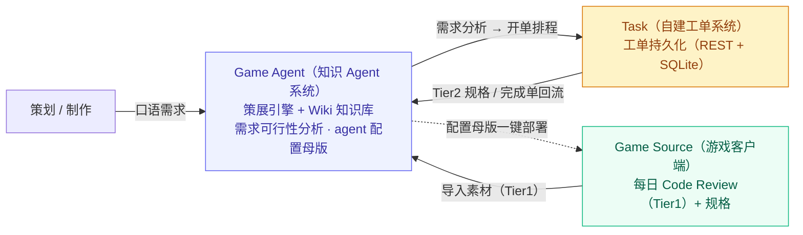

[English](README.md) · [繁體中文](README.zh-Hant.md) · **简体中文**

# GamePlusAIAgent — 游戏开发跨部门协作的 AI Agent 系统

> 以三大系统的协作，将每日的开发积累自动策展为 **AI 与人类共读**的活知识库，并让需求顺畅流入工单。

*「当我意识到每天早上都要花时间帮 AI 助理重新理解整包代码时，我决定为它构建一个具备自我策展能力的知识中枢。」*

本项目是一套为真实商业 Unity 手游项目打造的 AI Agent 系统的**设计展示（已进行去标识化处理）**。
它的核心不只是一个知识库，而是一套解决**游戏开发跨部门协作**的方案——由 **Game Source（游戏客户端）**、**Game Agent（知识 Agent 系统）** 与 **Task（自建工单系统）** 三大系统协作而成。

> 这个 Repo 想展示的不是单纯的「程序能跑」，而是一连串**非直觉的系统设计取舍**——每一个决策，都是在实际踩坑后提炼出的最优解。
> 如果时间有限，建议直接跳至 [设计巧思](#设计巧思系统层design-highlights)。

---

## 核心痛点与解决方案

在大型游戏项目的长期开发中，AI 要真正落地协助开发，必须回答三个问题：

- **如何运用 AI 优化游戏开发流程**：开发事实散落于 Commit、Code Review 与工单规格之中，AI 每次接入都得重新理解整包项目，速度慢且输出不稳定。
- **如何运用 AI 协助将需求梳理进工单**：策划难以跨越代码的技术门槛，提需求时却必须知道「这项功能会改动到哪、实现是否可行」。
- **如何迭代项目 Wiki，让下一个项目快速进入 AI+Game 开发**：每个新项目都从零搭建知识与工具链，成本极高，过往的积累难以沉淀、复用。

本系统以三大系统协作回应上述问题：
**Game Source 持续产出开发数据 → Game Agent 自动策展为 Wiki 知识库并进行需求可行性分析 → 分析结果流入 Task 工单系统排程 → 工单完成后再回流 Agent 提炼，形成持续成长的知识飞轮。**

---

## 三大系统与责任边界

整套方案的核心在于三个**独立维护、职责分明**的系统，以及它们之间刻意设计的边界：

| 系统 | 角色 | 核心责任 | 边界与解耦 |
|------|------|----------|------------|
| **Game Source**（游戏客户端） | 数据来源 | 每日产出 Code Review（高权威事实）与规格等开发积累数据；接收部署的 agent 配置 | 只读的部署目标，只负责供料，不参与策展 |
| **Game Agent**（知识 Agent 系统） | 系统大脑 | 策展数据成 Wiki 知识库、进行需求可行性分析；维护 agent 配置母版并一键部署 | 独立于游戏客户端之外，**可移植**至下一个项目 |
| **Task**（自建工单系统） | 协作枢纽 | 承接 AI 梳理后的需求并持久化追踪；工单完成后回流 Agent | 与另两者**完全解耦，仅通过 REST 交互**，本身不含 LLM |

---

## 系统如何运作（Data Lifecycle）

抛开繁琐的安装指令，我们以**一笔知识从产生到被消耗、再回流**的完整旅程来理解这套系统：

1. **产生 (Produce)** — Game Source 每日提交 Commit，上游 Skill 自动产出两种产物：留存于本地端的「工程回顾报告（供人类阅读）」，以及不含主观评价的「**程序事实素材**」（格式为：`做了什么 + 文件路径:行号`）。
2. **摄取 (Ingest)** — 将程序事实素材与工单规格，一并放入知识库的 `raw/` 收件箱（Inbox）。
3. **策展 (Curate)** — 执行 `/curate` 命令，清洗引擎会将 Raw 数据拆解为结构化的主题知识页，同时维护三种核心状态：**增量去重**、**权威仲裁**与**冲突队列**。
4. **索引 (Index)** — 通过 `build_index.py` 提取各主题页的 Frontmatter，**自动重生**一张语义路由表 `INDEX`（严禁人工手写修改）。
5. **召回与问答 (Recall & QA)** — 当策划以口语化方式提出新需求时，系统通过 `/stopic` 或 `/ask`，经由 `INDEX` 精确召回相关的主题知识页。
6. **落地 (Execute)** — AI 依据召回的知识判断「将影响哪些 `.cs` 文件、底层可行性如何」，产出开发 Plan 并将需求开立为工单，流入 Task 排程。
7. **回流 (Feedback)** — Task 工单完成后 export 回 Agent，再次进入 `/curate` 提炼，使知识库随项目演进持续成长。

---

## 设计巧思（系统层）（Design Highlights）

以下为**系统层**的三大核心决策；更底层的**知识引擎工程巧思**另见文末引导。

### A. 自建工单系统，而非沿用 Jira / Trello / Mantis

- **问题**：游戏内容的工单需求高度定制，且需与 AI agent 流程深度集成，业界通用工具难以贴合。
- **取舍**：未采用 Jira / Trello / Mantis 等通用工单，而是**自建工单系统**（自既有内部系统抽取核心改造）。
- **设计准则**：刻意保持极简、与 Agent / Source **完全解耦**（仅通过 REST 交互），工单系统本身**不含 LLM**——所有 AI 智能集中于 Agent 侧，工单系统纯粹承担需求的持久化与追踪。
- **效果**：工单可随游戏内容需求自定义，且因解耦而易于维护、不拖累 Agent 演进。

### B. Game Agent 与 Game Source 解耦，可移植至下一个项目

- **问题**：每个新游戏项目都从零搭建一套 AI 知识系统与工具链，成本极高。
- **取舍**：将 Agent 系统**独立于游戏客户端之外**；agent 配置（指令、命令、规范）集中于「**配置母版**」统一维护，再由安装器**一键部署**到游戏端。
- **效果**：换下一个项目时，复制 Agent、调整配置母版与配置路径即可快速套用整套机制，积累不随项目结束而流失。

### C. 三系统数据飞轮：愈用愈强的知识库

- Game Source 持续产出 Code Review / 规格等开发积累数据；
- Task 工单在**规格阶段**（Tier2 素材）与**完成阶段**（回流提炼）皆 export 回 Agent；
- Agent 将上述来源策展、累积为持续成长的 Wiki 知识库，反哺需求分析。
- **效果**：项目开发愈久，知识库愈强，下一个 AI+Game 项目能更快进入状态。

> 🔧 **想深入了解支撑这套系统的「知识引擎」工程巧思？**
> 包含为何不用 RAG（把结构化提前到 write-time）、「LLM 绝不自行推论」铁则、单文件三层格式、权威仲裁、INDEX 防漂移、增量去重等非直觉取舍，
> 完整展开请见 [`docs/design-notes.zh-Hans.md`](docs/design-notes.zh-Hans.md)。

---

## 系统架构（Architecture）

完整的系统架构（三大系统责任边界、数据流管线、目录结构、跨工具加载链、权威仲裁状态机、INDEX 维护链）请见 [`docs/architecture.zh-Hans.md`](docs/architecture.zh-Hans.md)。

---

## 技术栈与核心命令

- **策展 / 索引引擎**：Python（以标准库为主，降低部署依赖）
- **知识页格式**：Markdown（单文件三层架构）
- **跨工具加载链**：`CLAUDE.md` → `@AGENTS.md` → `@.agent/spec/*`；命令层采用 Junction 串接
- **工单集成**：自建工单系统，通过 REST API 交互
- **配置驱动**：所有路径、来源与权威分级集中于 `config.json`，引擎一律读取此文件，**杜绝硬编码**（亦为跨项目可移植的关键）

| 命令 | 作用 | 读 / 写 |
|------|------|---------|
| `/curate` | 将 Raw 清洗导入 Wiki，维护 .state 并重生 INDEX | 读 raw、写 wiki / .state |
| `/stopic` | 依关键词 / 语义加载相关主题页（多页召回） | 只读 wiki |
| `/ask` | 知识库问答 | 只读 wiki |
| `/resolve` | 处理 `review_queue` 中的待审项 | 读 / 写 .state |

---

## 项目状态

这是一套**运行于真实项目上**的系统，并非概念验证稿。

**已落地**

- 三大系统协作骨架（Game Source 供料、Game Agent 策展、Task 工单持久化）已运行。
- 策展引擎与四项命令（`/curate`、`/stopic`、`/ask`、`/resolve`）均可正常运作。
- 跨工具加载链（`@import` + Junction）与配置驱动（`config.json` 去硬编码）已构建完成。
- INDEX 由 Frontmatter 自动重生，并附 CI `--check` 防漂移机制。
- agent 配置母版可一键部署至游戏客户端；已对数十日的 Code Review 完成策展，产出数十页主题知识页。

**规划中**

- 上游 Code Review 知识素材的路径**自动导入**（目前为半自动）。
- 工单系统规格与完成单的**每日自动导出**至收件箱。
- **CLI 安装器**：一键重建加载链 / Junction / 配置注入（含 dry-run 模式）。
- 模块受控词表，对齐 Git Tag ↔ 知识库 Feature。
- **[可运行 Demo Repo](https://github.com/jokerjkeeper/GamePlusAIAgent-starter)**：去标识化的可运行起手包（另开 repo），示范如何把这套机制套用到自己的项目。

---

## 关于本 Repo（去标识化声明）

本 Repo 为某商业游戏项目 AI Agent 系统的**去标识化设计展示**，旨在呈现系统的设计思路。
内容**不含**该游戏的商业内容、源代码、真实路径、连接凭证、服务端口或任何机密信息；
所有系统名称、程序片段与文件名行号均为**化名或示意**。
