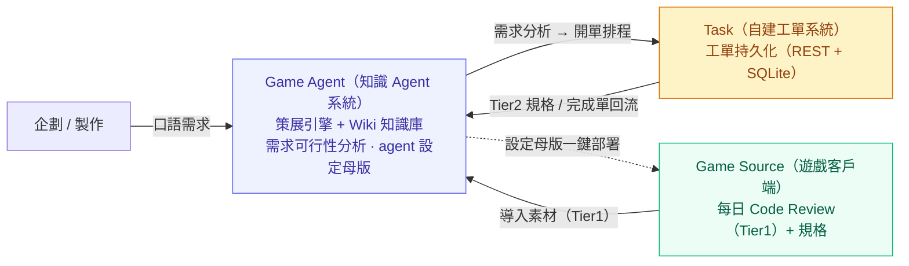

[English](README.md) · **繁體中文** · [简体中文](README.zh-CN.md)

# GamePlusAIAgent — 遊戲開發跨部門協作的 AI Agent 系統

> 以三大系統的協作，將每日的開發積累自動策展為 **AI 與人類共讀**的活知識庫，並讓需求順暢流入工單。

*「當我意識到每天早上都要花時間幫 AI 助理重新理解整包 Code 時，我決定幫它打造一個具備自我策展能力的知識中樞。」*

本專案是一套為真實商業 Unity 手遊專案打造的 AI Agent 系統的**設計展示（已進行去識別化處理）**。
它的核心不只是一個知識庫，而是一套解決**遊戲開發跨部門協作**的方案——由 **Game Source（遊戲客戶端）**、**Game Agent（知識 Agent 系統）** 與 **Task（自建工單系統）** 三大系統協作而成。

> 這個 Repo 想展示的不是單純的「程式能跑」，而是一連串**非直覺的系統設計取捨**——每一個決策，都是在實際踩坑後提煉出的最佳解。
> 如果時間有限，建議直接跳到 [設計巧思](#設計巧思系統層design-highlights)。

---

## 核心痛點與解決方案

在大型遊戲專案的長期開發中，AI 要真正落地協助開發，必須回答三個問題：

- **如何運用 AI 優化遊戲開發製程**：開發事實散落於 Commit、Code Review 與工單規格之中，AI 每次接入都得重新理解整包專案，速度慢且輸出不穩。
- **如何運用 AI 協助將需求梳理進工單**：企劃難以跨越 Code 的技術門檻，提需求時卻必須知道「這項功能會動到哪、實作是否可行」。
- **如何迭代專案 Wiki，讓下一個專案快速進入 AI+Game 開發**：每個新專案都從零搭建知識與工具鏈，成本極高，過往的積累難以沉澱、複用。

本系統以三大系統協作回應上述問題：
**Game Source 持續產出開發數據 → Game Agent 自動策展為 Wiki 知識庫並進行需求可行性分析 → 分析結果流入 Task 工單系統排程 → 工單完成後再回流 Agent 提煉，形成持續成長的知識飛輪。**

---

## 三大系統與責任邊界

整套方案的核心在於三個**獨立維護、職責分明**的系統，以及它們之間刻意設計的邊界：

| 系統 | 角色 | 核心責任 | 邊界與解耦 |
|------|------|----------|------------|
| **Game Source**（遊戲客戶端） | 數據來源 | 每日產出 Code Review（高權威事實）與規格等開發積累數據；接收部署的 agent 設定 | 唯讀的部署目標，只負責供料，不參與策展 |
| **Game Agent**（知識 Agent 系統） | 系統大腦 | 策展數據成 Wiki 知識庫、進行需求可行性分析；維護 agent 設定母版並一鍵部署 | 獨立於遊戲客戶端之外，**可移植**至下一個專案 |
| **Task**（自建工單系統） | 協作樞紐 | 承接 AI 梳理後的需求並持久化追蹤；工單完成後回流 Agent | 與另兩者**完全解耦，僅透過 REST 互動**，本身不含 LLM |

---

## 系統如何運作（Data Lifecycle）

拋開繁瑣的安裝指令，我們以**一筆知識從產生到被消耗、再回流**的完整旅程來理解這套系統：

1. **產生 (Produce)** — Game Source 每日提交 Commit，上游 Skill 自動產出兩種產物：留存於在地端的「工程回顧報告（供人類閱讀）」，以及不含主觀評價的「**程式事實素材**」（格式為：`做了什麼 + 檔案路徑:行號`）。
2. **攝取 (Ingest)** — 將程式事實素材與工單規格，一併放入知識庫的 `raw/` 收件匣（Inbox）。
3. **策展 (Curate)** — 執行 `/curate` 命令，清洗引擎將 Raw 資料拆解為結構化的主題知識頁，同時維護三種核心狀態：**增量去重**、**權威仲裁**與**衝突佇列**。
4. **索引 (Index)** — 透過 `build_index.py` 提取各主題頁的 Frontmatter，**自動重生**一張語意路由表 `INDEX`（嚴禁人工手寫修改）。
5. **召回與問答 (Recall & QA)** — 當企劃以口語化提出新需求時，系統透過 `/stopic` 或 `/ask`，經由 `INDEX` 精確召回相關的主題知識頁。
6. **落地 (Execute)** — AI 依據召回的知識判斷「將影響哪些 `.cs` 檔案、底層可行性如何」，產出開發 Plan 並將需求開立為工單，流入 Task 排程。
7. **回流 (Feedback)** — Task 工單完成後 export 回 Agent，再次進入 `/curate` 提煉，使知識庫隨專案演進持續成長。

---

## 設計巧思（系統層）（Design Highlights）

以下為**系統層**的三大核心決策；更底層的**知識引擎工程巧思**另見文末引導。

### A. 自建工單系統，而非沿用 Jira / Trello / Mantis

- **問題**：遊戲內容的工單需求高度客製，且需與 AI agent 流程深度整合，業界通用工具難以貼合。
- **取捨**：未採用 Jira / Trello / Mantis 等通用工單，而是**自建工單系統**（自既有內部系統抽取核心改造）。
- **設計準則**：刻意保持極簡、與 Agent / Source **完全解耦**（僅透過 REST 互動），工單系統本身**不含 LLM**——所有 AI 智能集中於 Agent 側，工單系統純粹承擔需求的持久化與追蹤。
- **效果**：工單可隨遊戲內容需求自訂，且因解耦而易於維護、不拖累 Agent 演進。

### B. Game Agent 與 Game Source 解耦，可移植至下一個專案

- **問題**：每個新遊戲專案都從零搭建一套 AI 知識系統與工具鏈，成本極高。
- **取捨**：將 Agent 系統**獨立於遊戲客戶端之外**；agent 設定（指令、命令、規範）集中於「**設定母版**」統一維護，再由安裝器**一鍵部署**到遊戲端。
- **效果**：換下一個專案時，複製 Agent、調整設定母版與配置路徑即可快速套用整套機制，積累不隨專案結束而流失。

### C. 三系統數據飛輪：愈用愈強的知識庫

- Game Source 持續產出 Code Review / 規格等開發積累數據；
- Task 工單在**規格階段**（Tier2 素材）與**完成階段**（回流提煉）皆 export 回 Agent；
- Agent 將上述來源策展、累積為持續成長的 Wiki 知識庫，反哺需求分析。
- **效果**：專案開發愈久，知識庫愈強，下一個 AI+Game 專案能更快進入狀態。

> 🔧 **想深入了解支撐這套系統的「知識引擎」工程巧思？**
> 包含為何不用 RAG（把結構化提前到 write-time）、「LLM 絕不自行推論」鐵則、單檔三層格式、權威仲裁、INDEX 防漂移、增量去重等非直覺取捨，
> 完整展開請見 [`docs/design-notes.zh-TW.md`](docs/design-notes.zh-TW.md)。

---

## 系統架構（Architecture）

完整的系統架構（三大系統責任邊界、資料流管線、目錄結構、跨工具載入鏈、權威仲裁狀態機、INDEX 維護鏈）請見 [`docs/architecture.zh-TW.md`](docs/architecture.zh-TW.md)。

---

## 技術棧與核心命令

- **策展 / 索引引擎**：Python（以標準庫為主，降低部署依賴）
- **知識頁格式**：Markdown（單檔三層架構）
- **跨工具載入鏈**：`CLAUDE.md` → `@AGENTS.md` → `@.agent/spec/*`；命令層採 Junction 串接
- **工單整合**：自建工單系統，透過 REST API 互動
- **配置驅動**：所有路徑、來源與權威分級集中於 `config.json`，引擎一律讀取此檔，**杜絕硬編碼**（亦為跨專案可移植的關鍵）

| 命令 | 作用 | 讀 / 寫 |
|------|------|---------|
| `/curate` | 將 Raw 清洗匯入 Wiki，維護 .state 並重生 INDEX | 讀 raw、寫 wiki / .state |
| `/stopic` | 依關鍵詞 / 語意載入相關主題頁（多頁召回） | 唯讀 wiki |
| `/ask` | 知識庫問答 | 唯讀 wiki |
| `/resolve` | 處理 `review_queue` 中的待審項 | 讀 / 寫 .state |

---

## 專案狀態

這是一套**運行於真實專案上**的系統，並非概念驗證稿。

**已落地**

- 三大系統協作骨架（Game Source 供料、Game Agent 策展、Task 工單持久化）已運行。
- 策展引擎與四項命令（`/curate`、`/stopic`、`/ask`、`/resolve`）皆可正常運作。
- 跨工具載入鏈（`@import` + Junction）與配置驅動（`config.json` 去硬編碼）已建置完成。
- INDEX 由 Frontmatter 自動重生，並附 CI `--check` 防漂移機制。
- agent 設定母版可一鍵部署至遊戲客戶端；已對數十日的 Code Review 完成策展，產出數十頁主題知識頁。

**規劃中**

- 上游 Code Review 知識素材的路徑**自動導入**（目前為半自動）。
- 工單系統規格與完成單的**每日自動導出**至收件匣。
- **CLI 安裝器**：一鍵重建載入鏈 / Junction / 配置注入（含 dry-run 模式）。
- 模組受控詞表，對齊 Git Tag ↔ 知識庫 Feature。
- **可運行 Demo Repo**：去識別化的可運行起手包（另開 repo），示範如何把這套機制套用到自己的專案。

---

## 關於本 Repo（去識別化聲明）

本 Repo 為某商業遊戲專案 AI Agent 系統的**去識別化設計展示**，旨在呈現系統的設計思路。
內容**不含**該遊戲的商業內容、原始碼、真實路徑、連線憑證、服務埠或任何機密資訊；
所有系統名稱、程式片段與檔名行號均為**化名或示意**。
