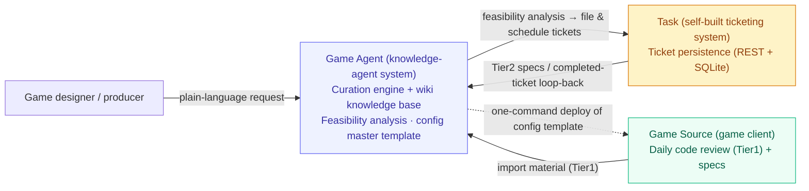
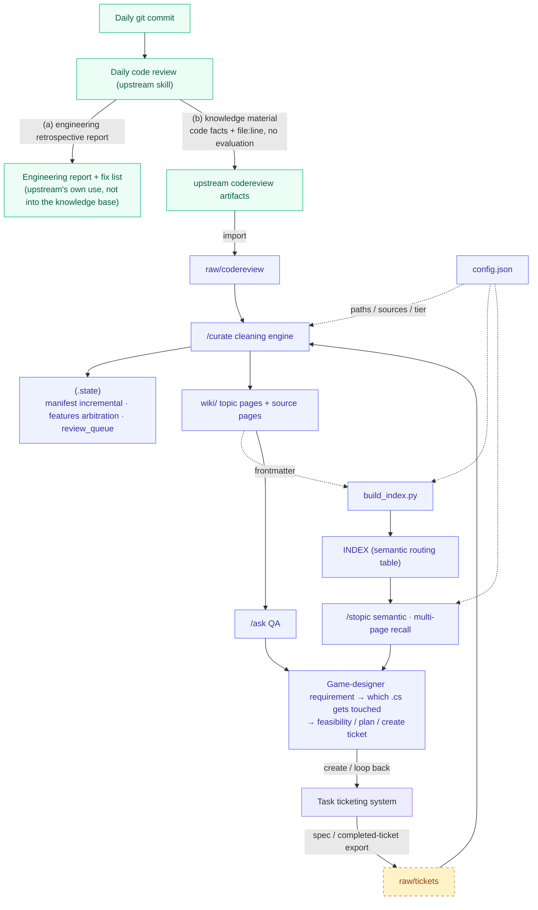
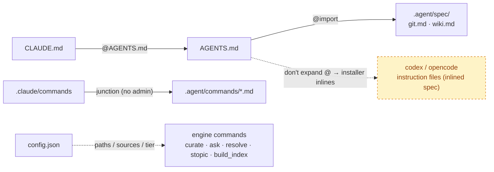
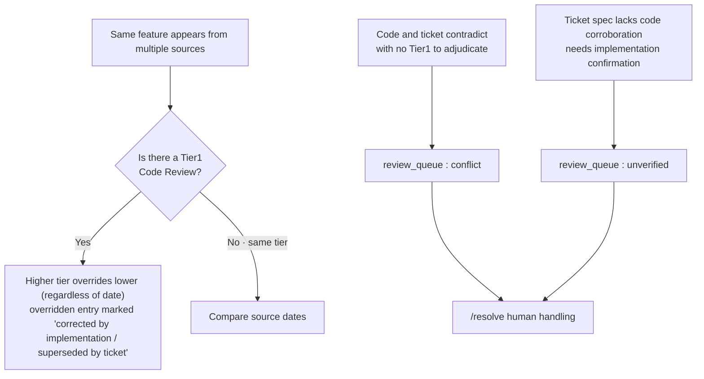
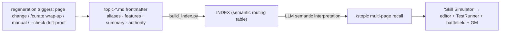

**English** · [繁體中文](architecture.zh-Hant.md) · [简体中文](architecture.zh-Hans.md)

# System Architecture (De-identified)

> This document is an architecture snapshot of the AI agent system for a commercial Unity mobile-game project, with sensitive details removed.
> The whole solution is formed by three collaborating systems: **Game Source (the game client)**, **Game Agent (the knowledge-agent system, the subject this repo showcases)**, and **Task (a self-built ticketing system)**.

---

## ① The Three Systems & Responsibility Boundaries

| System | Role | Core Responsibility | Boundary & Decoupling |
|--------|------|---------------------|------------------------|
| **Game Source** (game client) | Data source | Produces daily code reviews (Tier1 facts) and specs; receives the deployed agent configuration | A read-only deployment target — it only feeds material, taking no part in curation |
| **Game Agent** (knowledge-agent system) | The system's brain | Curates data into a wiki knowledge base and performs requirement-feasibility analysis; maintains the agent config master template and deploys it with one command | Lives outside the game client; portable to the next project |
| **Task** (self-built ticketing system) | Collaboration hub | Persists and tracks tickets; loops completed tickets back to the Agent | Decoupled from the other two, interacting only via REST; contains no LLM itself |



---

## ② Data-Flow Pipeline (produce → curate → requirement analysis → loop-back)



**Responsibility split across the two ends**

| End | Role |
|-----|------|
| Game client · codereview artifacts | **code data**: what the code did + `file:line`, one file per day |
| Game client · engineering report + fix list | **bug / risk / evaluation**: upstream's own use, not into the knowledge base |
| Knowledge base · `wiki/` | **knowledge base**: split into "feature / code" layers, for the AI to load on demand for requirement analysis |

---

## ③ Directory Structure and Responsibilities

```text
agent/                            ← wiki startup directory = the knowledge base itself (Game Agent)
├ CLAUDE.md                       @AGENTS.md (Claude Code entry point)
├ AGENTS.md                       cross-tool instruction index → @.agent/spec/*
├ .agent/
│  ├ config.json                  ★paths / sources / authority tiers; every engine reads this file (no hardcoding)
│  ├ commands/                    engine commands: curate / ask / resolve / stopic
│  └ spec/  git.md  wiki.md       canonical specs (commit format / file split·feature)
├ .claude/
│  └ commands ──junction──▶ .agent/commands   (no elevation, lets Claude Code recognize the commands)
├ scripts/
│  └ build_index.py               ★INDEX auto-regeneration (from each topic page's frontmatter)
├ raw/        codereview/  tickets/             ingestion inbox
├ .state/     manifest / features / review_queue   incremental · arbitration · queue
└ wiki/       topic-*.md  source/  INDEX.md       curated knowledge pages + routing table
```

> In addition, Game Agent maintains an **agent config master template** (instructions / commands / specs / configuration), deployed to Game Source with one command by an installer; this is the key infrastructure behind "cross-project portability."

---

## ④ Cross-Tool Loading / Control Chain (cc · codex · opencode, all three covered)



**Each layer uses the right mechanism**

| Layer | Mechanism | Why |
|-------|-----------|-----|
| Instruction file | `AGENTS.md` is the single source of truth, `CLAUDE.md` `@import` | `@import` needs no administrator privileges; symlink requires elevation on Windows |
| Command | Windows junction | directory link, creating it needs no administrator privileges (only symlink does) |
| Compatibility | installer inlines the spec | codex / opencode don't expand `@import` |

---

## ⑤ Authority-Arbitration State Machine (.state core)



- **Tiering**: `Tier1 Code Review (reads real code)` ＞ `Tier2 ticket spec`.
- **Hard rule**: authority tiers and finalized decisions are set by humans or rules; the **LLM never infers** on its own — it only executes.
- **Incremental**: relies on the manifest's `content_hash`; if nothing changed, skip — no repeated curation.

---

## ⑥ INDEX Maintenance Chain (drift-proof)



INDEX **must not be hand-written**: it is regenerated from each page's frontmatter, and CI `--check` returns `exit 1` the moment it goes stale.
