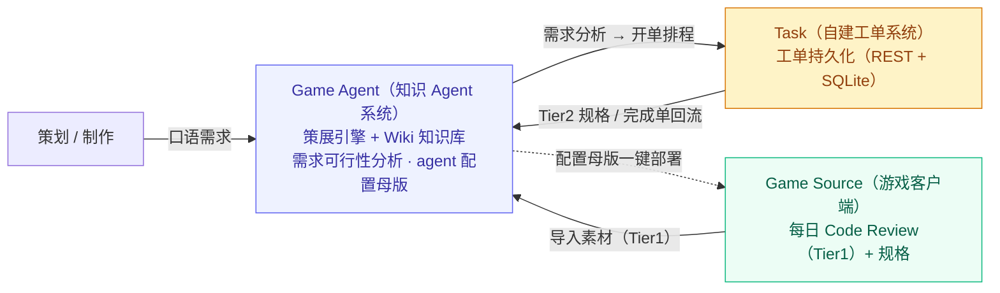
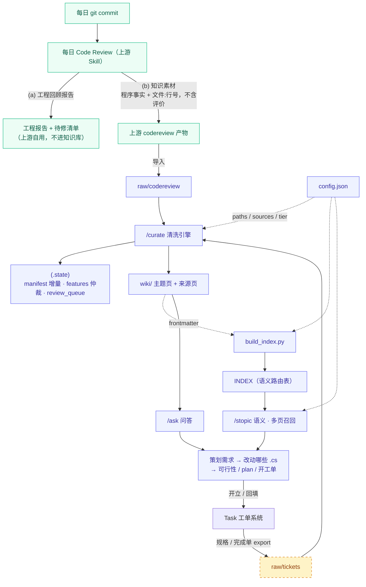
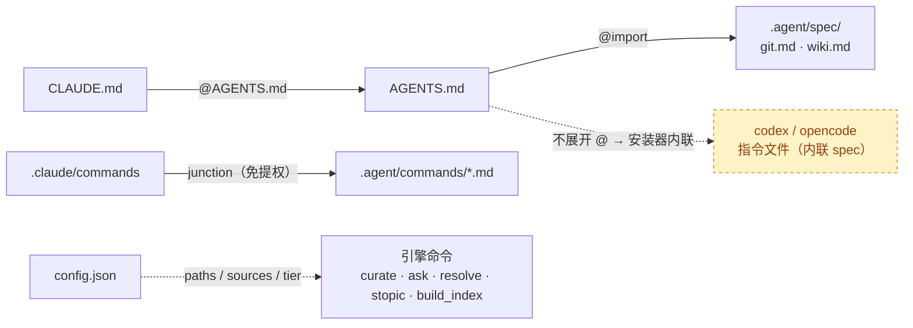
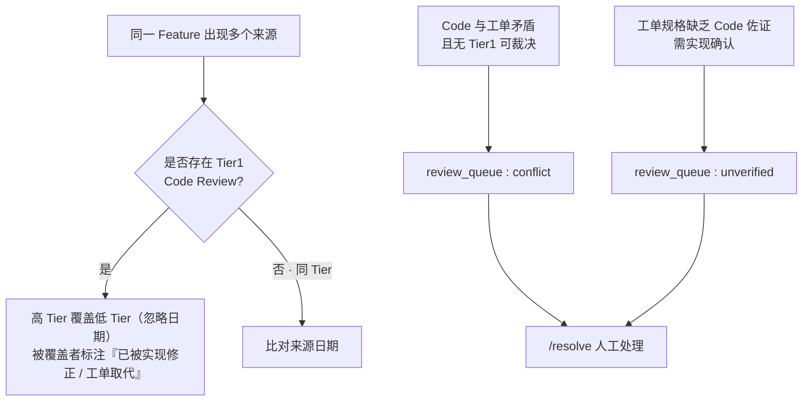
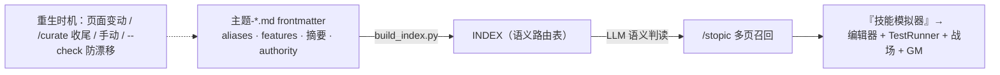

[English](architecture.md) · [繁體中文](architecture.zh-TW.md) · **简体中文**

# 系统架构（去标识化）

> 本文件为某商业 Unity 手游项目 AI Agent 系统的架构快照，已脱敏。
> 整套方案由三大系统协作：**Game Source（游戏客户端）**、**Game Agent（知识 Agent 系统，本 repo 展示主体）** 与 **Task（自建工单系统）**。

---

## ① 三大系统与责任边界

| 系统 | 角色 | 核心责任 | 边界与解耦 |
|------|------|----------|------------|
| **Game Source**（游戏客户端） | 数据来源 | 每日产出 Code Review（Tier1 事实）与规格；接收部署的 agent 配置 | 只读部署目标，只供料，不参与策展 |
| **Game Agent**（知识 Agent 系统） | 系统大脑 | 策展成 Wiki 知识库、需求可行性分析；维护 agent 配置母版并一键部署 | 独立于游戏客户端外，可移植至下一项目 |
| **Task**（自建工单系统） | 协作枢纽 | 工单持久化与追踪；完成单回流 Agent | 与另两者解耦，仅通过 REST 交互，本身不含 LLM |



---

## ② 数据流管线（产生 → 策展 → 需求分析 → 回流）



**两端职责切分**

| 端 | 角色 |
|----|------|
| 游戏客户端 · codereview 产物 | **code 数据**：程序做了什么 + `文件:行号`，一天一档 |
| 游戏客户端 · 工程报告 + 待修清单 | **bug / 风险 / 评价**：上游自用，不进知识库 |
| 知识库 · `wiki/` | **知识库**：拆分为「功能 / code」分层，供 AI 按需加载以进行需求分析 |

---

## ③ 目录结构与职责

```text
agent/                            ← wiki 启动目录 = 知识库本体（Game Agent）
├ CLAUDE.md                       @AGENTS.md（Claude Code 入口）
├ AGENTS.md                       跨工具指令索引 → @.agent/spec/*
├ .agent/
│  ├ config.json                  ★路径 / 来源 / 权威分级，引擎一律读取此文件（不硬编码）
│  ├ commands/                    引擎命令：curate / ask / resolve / stopic
│  └ spec/  git.md  wiki.md       canonical 规范（提交格式 / 拆档·feature）
├ .claude/
│  └ commands ──junction──▶ .agent/commands   （免提权，让 Claude Code 识别命令）
├ scripts/
│  └ build_index.py               ★INDEX 自动重生（从各主题页 frontmatter）
├ raw/        codereview/  tickets/             摄取 inbox
├ .state/     manifest / features / review_queue   增量·仲裁·队列
└ wiki/       主题-*.md  来源/  INDEX.md        策展知识页 + 路由表
```

> 此外，Game Agent 另维护一份 **agent 配置母版**（指令 / 命令 / 规范 / 配置），由安装器一键部署至 Game Source；这是「跨项目可移植」的关键基础设施。

---

## ④ 跨工具加载 / 控制链（cc · codex · opencode 三家通吃）



**三层各用对的机制**

| 层 | 机制 | 为什么 |
|----|------|--------|
| 指令文件 | `AGENTS.md` 为单一真相，`CLAUDE.md` `@import` | `@import` 免管理员权限；symlink 在 Windows 需提权 |
| 命令 | Windows junction | 目录连接，创建免管理员权限（symlink 才需要） |
| 兼容 | 安装器内联 spec | codex / opencode 不展开 `@import` |

---

## ⑤ 权威仲裁状态机（.state 核心）



- **分级**：`Tier1 Code Review（读取真实代码）` ＞ `Tier2 工单规格`。
- **铁则**：权威分级与定案状态由人 / 规则决定，**LLM 绝不自行推论**，只负责执行。
- **增量**：依赖 manifest 的 `content_hash`，未变更则跳过，不重复策展。

---

## ⑥ INDEX 维护链（防漂移）



INDEX **不准手写**：由各页 frontmatter 重生，CI `--check` 过期即 `exit 1`。
