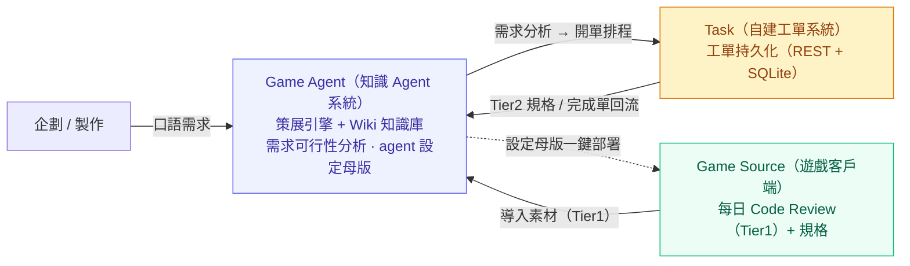
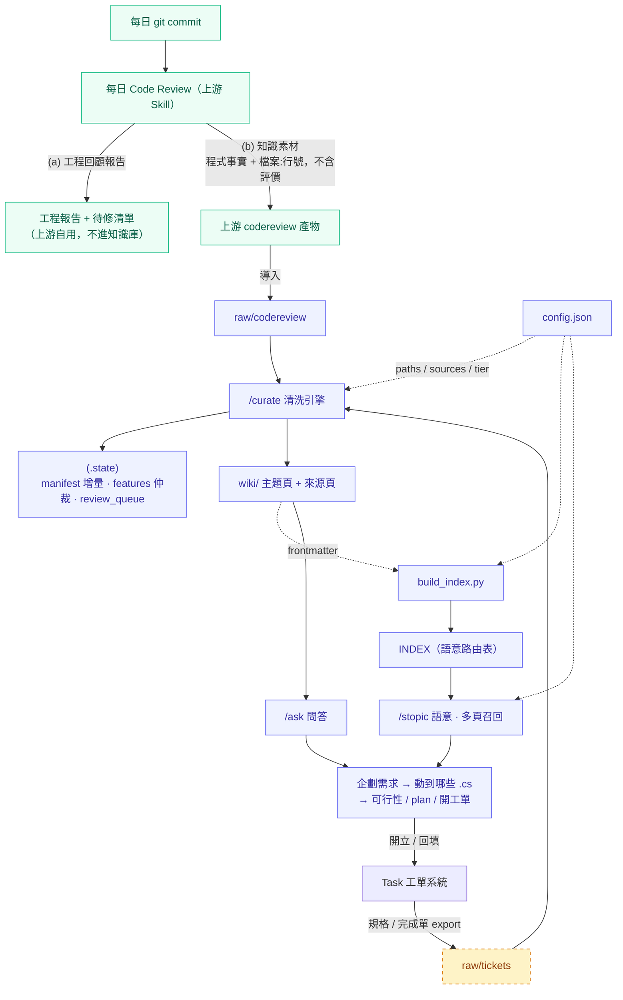
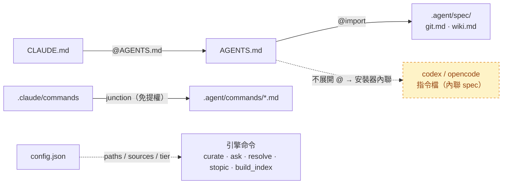
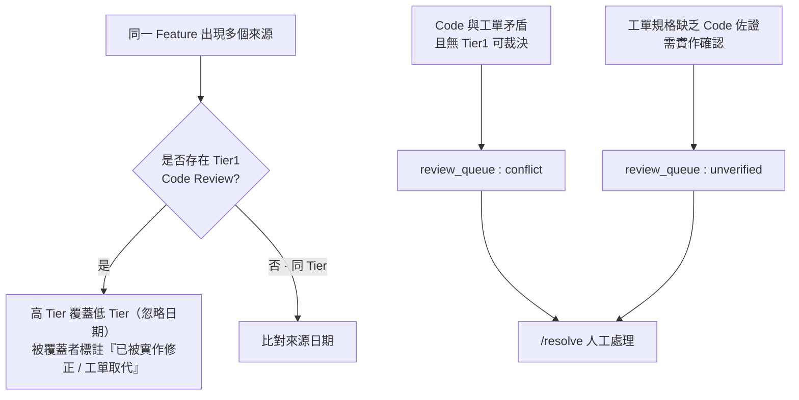
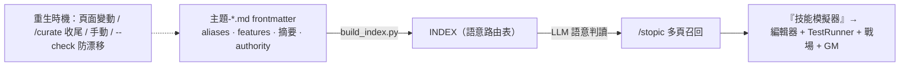

[English](architecture.md) · **繁體中文** · [简体中文](architecture.zh-Hans.md)

# 系統架構（去識別化）

> 本檔為某商業 Unity 手遊專案 AI Agent 系統的架構快照，已脫敏。
> 整套方案由三大系統協作：**Game Source（遊戲客戶端）**、**Game Agent（知識 Agent 系統，本 repo 展示主體）** 與 **Task（自建工單系統）**。

---

## ① 三大系統與責任邊界

| 系統 | 角色 | 核心責任 | 邊界與解耦 |
|------|------|----------|------------|
| **Game Source**（遊戲客戶端） | 數據來源 | 每日產出 Code Review（Tier1 事實）與規格；接收部署的 agent 設定 | 唯讀部署目標，只供料，不參與策展 |
| **Game Agent**（知識 Agent 系統） | 系統大腦 | 策展成 Wiki 知識庫、需求可行性分析；維護 agent 設定母版並一鍵部署 | 獨立於遊戲客戶端外，可移植至下一專案 |
| **Task**（自建工單系統） | 協作樞紐 | 工單持久化與追蹤；完成單回流 Agent | 與另兩者解耦，僅透過 REST 互動，本身不含 LLM |



---

## ② 資料流管線（產生 → 策展 → 需求分析 → 回流）



**兩端職責切分**

| 端 | 角色 |
|----|------|
| 遊戲客戶端 · codereview 產物 | **code 數據**：程式做了什麼 + `檔案:行號`，一天一檔 |
| 遊戲客戶端 · 工程報告 + 待修清單 | **bug / 風險 / 評價**：上游自用，不進知識庫 |
| 知識庫 · `wiki/` | **知識庫**：拆分為「功能 / code」分層，供 AI 按需載入以進行需求分析 |

---

## ③ 目錄結構與職責

```text
agent/                            ← wiki 啟動目錄 = 知識庫本體（Game Agent）
├ CLAUDE.md                       @AGENTS.md（Claude Code 入口）
├ AGENTS.md                       跨工具指令索引 → @.agent/spec/*
├ .agent/
│  ├ config.json                  ★路徑 / 來源 / 權威分級，引擎一律讀取此檔（不硬編碼）
│  ├ commands/                    引擎命令：curate / ask / resolve / stopic
│  └ spec/  git.md  wiki.md       canonical 規範（提交格式 / 拆檔·feature）
├ .claude/
│  └ commands ──junction──▶ .agent/commands   （免提權，讓 Claude Code 識別命令）
├ scripts/
│  └ build_index.py               ★INDEX 自動重生（從各主題頁 frontmatter）
├ raw/        codereview/  tickets/             攝取 inbox
├ .state/     manifest / features / review_queue   增量·仲裁·佇列
└ wiki/       主題-*.md  來源/  INDEX.md        策展知識頁 + 路由表
```

> 此外，Game Agent 另維護一份 **agent 設定母版**（指令 / 命令 / 規範 / 配置），由安裝器一鍵部署至 Game Source；這是「跨專案可移植」的關鍵基礎設施。

---

## ④ 跨工具載入 / 控制鏈（cc · codex · opencode 三家通吃）



**三層各用對的機制**

| 層 | 機制 | 為什麼 |
|----|------|--------|
| 指令檔 | `AGENTS.md` 為單一真相，`CLAUDE.md` `@import` | `@import` 免管理員權限；symlink 在 Windows 需提權 |
| 命令 | Windows junction | 目錄連結，建立免管理員權限（symlink 才需要） |
| 相容 | 安裝器內聯 spec | codex / opencode 不展開 `@import` |

---

## ⑤ 權威仲裁狀態機（.state 核心）



- **分級**：`Tier1 Code Review（讀取真實程式碼）` ＞ `Tier2 工單規格`。
- **鐵則**：權威分級與定案狀態由人 / 規則決定，**LLM 絕不自行推論**，只負責執行。
- **增量**：依賴 manifest 的 `content_hash`，未變更則略過，不重複策展。

---

## ⑥ INDEX 維護鏈（防漂移）



INDEX **不准手寫**：由各頁 frontmatter 重生，CI `--check` 過期即 `exit 1`。
